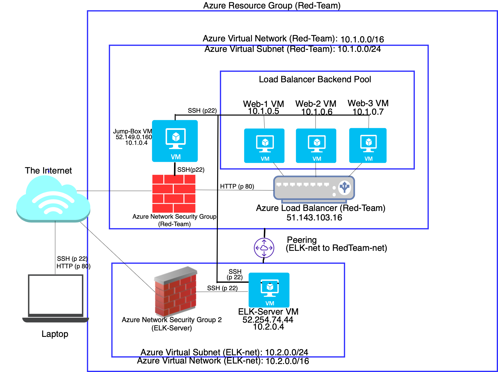

# ELK-Stack Demo
This <b>ELK Stack</b> demo was created and deployed in an <a href="https://portal.azure.com">Azure</a>  Cloud environment. The purpose of this demo is to showcase SIEM servers, monitoring log events, detecting and alerting for anomalous activities in the cloud. 

<b>ELK Stack</b> monitored <a href="https://www.elastic.co/beats/filebeat">Filebeat</a> & <a href="https://www.elastic.co/beats/metricbeat">Metricbeat</a> for a Damn Vulnerable Web App (<b><a href="http://www.dvwa.co.uk">DVWA</a></b>) container. Filebeat monitored and collected log events of ongoing processes in realtime. Metricbeat collected metrics such as CPU and memory. The <a href="https://www.elastic.co/guide/en/siem/guide/current/index.html">SIEM</a> app detected anomalous activities as well as alerted for potential security threats e.g., authentication failures due to unauthorized access.
 

In the following instructions below, I will guide you step-by-step on how to emulate building and deploying the ELK-Stack in an Azure Cloud environment. By following these steps, you will build an ELK Stack, and you will be able to monitor Filebeat and Metricbeat logs, as well as detect security threats and be alerted for anomalous activities.

At the end of this ReadMe document, you will view screenshot captures of the environment I built, displaying examples of the capabilities of the ELK Stack built in Azure. You too can build the same environment if you choose to follow the provided steps below on your own.

🙌 Hooray! Let's get started! 🙌
# Building the ELK-Stack #
Open the Azure Cloud environment to get started ☕ 

ツ In the following order, we will begin by building our basic foundation in Azure starting with creating the following: Resource Group, Virtual Network, Network Security Group & Inbound Security Rules, SSH-Key. 

Afterward, we will build our Virtual Machines including a <a href="https://www.docker.com/">Docker</a> container in which <a href="https://www.ansible.com/hubfs/pdfs/Ansible-InDepth-WhitePaper.pdf">Ansible</a> will be deployed inside of. 

Lastly, we will create our Ansible and <a href="https://www.gnu.org/software/bash/">Bash</a> scripts that we will run in order to access the ELK server landing page (<a href="https://www.elastic.co/what-is/kibana">Kibana</a>). This is where the magic happens when we can utilize Filebeat and Metricbeat for monitoring logs, as well as the utilization of SIEM for detecting security threats alerting for anomalous activities.

# Azure Cloud Environment Setup 
## Resource Group Creation ##

1. Create the Resource Group and name it 'Red-Team'
2. Select Region: US West 2
## Virtual Network (VNet) Creation ##

1. Create the VNet and name it 'RedTeamNet'
2. Select the Resource Group 'Red-Team' just created
3. Create the VNet with network IP range 10.1.0.0/16
4. Create default subnet with IP range 10.1.0.0/24

## Establish Network Security Group ##

1. Create a Network Security Group 'Red-Team-NSG'
2. Select Region: US West 2
3. Create the following Inbound Security Rule to block ALL traffic. ⚠️⚠️⚠️ IMPORTANT! ⚠️⚠️⚠️ <b><u>DO NOT SKIP THIS STEP</b></u> in order to protect the environment as you are building it!!</b> The NSG is subsequently modified to allow specific traffic as the infrastructure is built. 

The Inbound Security Rule is as follows:

    1. Source: Any
    2. Source Port: */Any
    3. Destination: Any
    4. Destination Port: */0-65535
    5. Protocol: Any
    6. Action: Block
    7. Priority: 4096
    8. Name: BLOCK_ALL
    9. Description: Block all inbound traffic


## 🔑🔑  SSH Key Creation  ##

1. Create an SSH key on your local machine to allow SSH access to the virtual machines which we will be creating soon. 

Open up your terminal and run the following command:

```bash
$ ssh-keygen -f ~/.ssh/elkstack_demo
```
☝ This command will automatically generate both a <b>private</b> <i>and</i> <b>public</b> SSH key on your machine in your .ssh folder in a file named elkstack_demo <i>(or any file name of your choice)</i>.

    *NOTE: Make sure to have an empty passphrase. DO NOT type a passphrase! Doing so may create conflicts when running Ansible Playbook scripts later, and you will have to regenerate your key again.

👉 You will notice there are two SSH key files created: 

~/.ssh/elkstack_demo
<b>and</b>
~/.ssh/elkstack_demo.pub

⚠️ Be mindful that the key file ending in .pub is your <b>PUBLIC</b> key. The other file contains your private key. ⚠️⚠️⚠️ <u><b>DO NOT PASTE YOUR PRIVATE KEY ANYWHERE IN PUBLIC!</b></u> ⚠️⚠️⚠️

2. Run the following command to ensure your public key was generated:

    ```bash
    $ cat ~/.ssh/elkstack_demo.pub
    ```

3. Copy your public key and paste it somewhere safe because we will be using it later to SSH into the virtual machines we will be creating next.

# Virtual Machines #
We will create a total of four virtual machines in our Azure cloud environment.

The <i>first</i> VM we will create is the <b>Jump Box Provisioner</b>. It is the first VM we will SSH into from our local machine. The Jump Box is where we will deploy the Docker container titled DVWA and run Ansible playbooks inside of it — allowing us to gain access to Kibana, and to utilize Filebeat and Metricbeat for monitoring.

The <i>second</i> and <i>third</i> VMs we will create will be <b>Web-1</b> and <b>Web-2</b>. They will run the Docker container DVWA, and they may also be configured to allow access to the Damn Vulnerable Web App (DVWA) setup page as well (optional — but more on this later).

Last but not least, the <i>fourth</i> VM we will create will be the <b>ELK-Server</b>. The ELK-Server is where we will run our Ansible Playbook scripts to gain entry to the ELK Server landing page, also known as Kibana, where we can utilize Filebeat and Metricbeat to monitor log events on the VMs <b>Web-1</b> and <b>Web-2</b> which may run the Docker container DVWA.

🤖🤖🤖🤖🤖 Let's begin building our virtual machines! 🤖🤖🤖🤖🤖


## 👾 VM 1 - Jump Box Provisioner 

The first virtual machine we will create is the Jump Box which we will access from our local machine via SSH login on our terminal. We will also use SSH login to access the <i>other</i> three VMs in our Azure cloud environment from our Jump Box as well.  

Follow these steps in Azure to create the first VM.

```bash
1. Create a Virtual Machine and name it 'Jump-Box-Provisioner'
2. Select Resource Group: 'Red-Team'
3. Region: US West 2
4. Availability Options: No infrastructure redundancy required
5. Ubuntu Server 18.04 LTS
6. VM Options:
	1. Standard B1s
		1. 1 CPU
		2. 1 GB RAM
7. Authentication: SSH Public Key (Use public key that was just generated) 
8. Username: azureuser (or any name of choice)
9. Paste key generated from above
10. Paste the Public key from above.
11. Public Inbound Ports:  IGNORE
12. Select Inbound Ports: IGNORE
13. Disks - No changes
14. Choose Subnet: default 10.1.0.0/24
15. Select Virtual Network: 'RedTeamNet'
16. Create New Public IP
    1. Name Public IP 'Jump-Box-Provisioner-ip'
    2. SKU: Basic
    3. Assignment: Static
17. NIC Security Group: Advanced
18. Network Security Group: 'Red-Team-NSG'
19. Accelerated networking: Off
20. Management:
    1. Boot diagnostics: Disable
    2. Leave the rest as default
21. Advanced: All defaults
```

## 👾 VM 2 - Web 1

Create 




